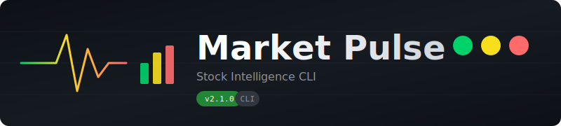

<div align="center">



<br>
<br>

[](https://python.org)
[](https://github.com/kunalnano/market-pulse/releases/latest)
[](LICENSE)
[](https://github.com/kunalnano/market-pulse/stargazers)

**Your personal stock market radar — scan, score, decide.**

[Features](#-features) • [Install](#-install) • [Usage](#-usage) • [Indicators](#-indicators)

<br>


</div>

<br>

---

<br>

## ✨ Features

<table>
<tr>
<td>

### 📊 Technical Analysis
8 indicators working together:
- **RSI** — Momentum exhaustion (oversold/overbought)
- **MACD** — Trend direction & momentum
- **Bollinger Bands** — Volatility extremes
- **Moving Averages** — 50 & 200-day trends
- **Golden/Death Cross** — Major trend shifts
- **52-Week Position** — Where in the yearly range
- **P/E Ratio** — Valuation check
- **Volume** — Move confirmation

</td>
<td>

### 🎯 Signal Scoring
No analysis paralysis. Just traffic lights:

| Signal | Meaning |
|:------:|---------|
| 🟢 | Bullish — potential opportunity |
| 🟡 | Neutral — hold / watch |
| 🔴 | Bearish — caution / wait |

**More green than red?** Look closer.  
**More red than green?** Move on.

</td>
</tr>
</table>

<br>

<table>
<tr>
<td>

### 📈 Sparklines
10-day visual trend at a glance:
```
▁▃▅▇▇▇▇▇▆█  ↗ +4.2%
```
See momentum before reading a single number.

</td>
<td>

### 📰 News Radar
Track keywords across:
- Hacker News
- TechCrunch  
- The Verge
- Ars Technica

AI, earnings, your companies — all filtered.

</td>
<td>

### 🌐 One-Click Charts
```bash
pulse open AAPL
```
Opens TradingView instantly.  
Also supports Yahoo & Google Finance.

</td>
</tr>
</table>

<br>

---

<br>

## 🚀 Install

```bash
# Clone
git clone https://github.com/kunalnano/market-pulse.git
cd market-pulse

# Setup (Python 3.10+ required)
python3 -m venv venv
source venv/bin/activate
pip install -r requirements.txt
pip install -e .

# Run (installed console script)
pulse --version
pulse scan
```

<details>
<summary><b>💡 Optional: Shell function if not installed</b></summary>

If you prefer not to `pip install -e .`, you can add a small function (note the quotes to handle spaces in paths):

```bash
pulse() {
  "/absolute/path/to/market-pulse/venv/bin/python" \
  "/absolute/path/to/market-pulse/pulse.py" "$@"
}
```

Reload your shell RC and use `pulse` from anywhere.

</details>

<br>

---

<br>

## 📖 Usage

```bash
pulse                              # Full scan (default)
pulse stocks                       # Detailed analysis
pulse news                         # Matching headlines
pulse legend                       # What each indicator means
pulse open AAPL                    # Chart in browser
pulse open MSFT --source yahoo     # Yahoo Finance
pulse config --show                # View settings
pulse config --add-stock NVDA      # Add to watchlist
pulse config --remove-stock NVDA   # Remove
pulse config --add-keyword "Tesla" # Track keyword
pulse watch --interval 15          # Live dashboard refresh every 15s
```

<br>

---

<br>

## 🎨 Indicators

<div align="center">

| Indicator | 🟢 Bullish | 🔴 Bearish | What it tells you |
|:---------:|:----------:|:----------:|-------------------|
| **RSI** | < 30 | > 70 | Momentum exhaustion |
| **MACD** | ↗ Crossover | ↘ Crossover | Trend momentum |
| **MA Cross** | Golden | Death | Major trend shift |
| **vs SMA200** | Above | Below | Long-term direction |
| **52w Range** | < 25% | > 85% | Near low vs high |
| **Bollinger** | < 20% | > 80% | Volatility extremes |
| **P/E Ratio** | < 15 | > 35 | Cheap vs expensive |

</div>

> **New to indicators?** Run `pulse legend` for plain-English explanations with analogies.

<br>

---

<br>

## ⚙️ Config

First run creates a user config at one of the standard locations:

- macOS: `~/Library/Application Support/market-pulse/config.json`
- Linux: `~/.config/market-pulse/config.json`
- Windows: `%APPDATA%/market-pulse/config.json`

To override the location, set `MARKET_PULSE_CONFIG=/path/to/config.json`.

If you cloned the repo earlier and already have `config.json` next to `pulse.py`, it will continue to be used.

Defaults:

| Setting | Default |
|---------|---------|
| **Stocks** | AAPL, GOOGL |
| **Keywords** | Google, Apple, AI, OpenAI, Claude, Anthropic |
| **Feeds** | HN, TechCrunch, The Verge, Ars Technica |

Config is gitignored — your watchlist stays private.

<br>

---

<br>

## 🛠 Stack

<div align="center">

[](https://github.com/ranaroussi/yfinance)
[](https://github.com/Textualize/rich)
[](https://github.com/kurtmckee/feedparser)
[](https://pandas.pydata.org)

</div>

<br>

---

<br>

<div align="center">

### Built in one conversation with [Claude](https://anthropic.com).

The kind of tool that used to take a weekend now takes an hour.

<br>

**[⭐ Star this repo](https://github.com/kunalnano/market-pulse/stargazers)** if it's useful.

<br>

<sub>MIT License — do whatever you want with it.</sub>

</div>
## 🚀 What’s New (v2.1.0)

- New live dashboard: `pulse watch --interval 15`
- Richer TUI with stock cards, sparklines, verdict badges
- Spinners/progress on fetch, cleaner columns layout
- Config helpers: de-dupe, list, remove keyword
- Packaging polish: `pulse` console script, safer config path
- See full notes: [CHANGELOG](CHANGELOG.md)
